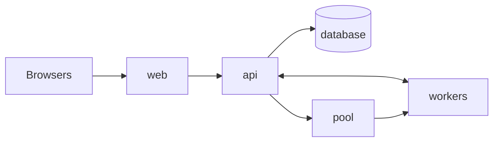
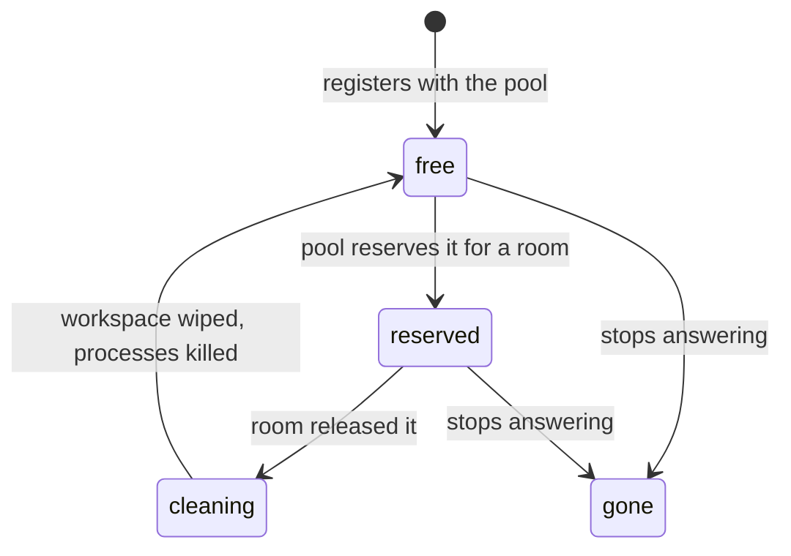
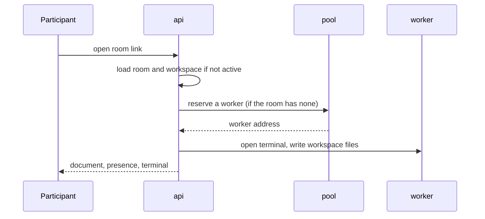
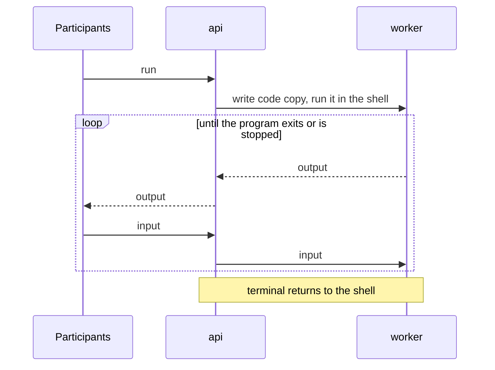

# pairbox — design

pairbox is a self-hosted collaborative coding pad. The host shares a link. Everyone in the room edits the same code in the browser and works in the same terminal, which runs on an isolated worker.

It is built from a few small services. They only talk to each other over HTTP and WebSockets, so each one can run anywhere: all on one machine with `docker compose up`, or spread across machines and real VMs later.

## Scope

**In scope**

- Real-time collaborative editing, with nothing for guests to install.
- An editor in the browser good enough that nobody misses their IDE.
- A shared, interactive terminal for each room, on a real shell, that everyone can see and type into.
- Accounts with email and password. Signed-in users create and manage their own rooms; guests join by link without an account.
- Self-hosting with one command (`docker compose up`).
- Adding workers, on the same machine or others, when more rooms need to run at once.

**Out of scope for now**

- Teams, roles and billing. Each account owns its rooms; sharing ownership can come later.
- Multi-file projects. One file per room keeps the document model simple. Workers already use a workspace folder, so projects can come later.
- Desktop editor plugins. All effort goes into the browser editor.
- Reconnect handling. It can be added once the core works.

## Principles

- **The core is pure.** Domain logic never touches the network, containers or disks, so it can be tested on its own.
- **Infrastructure is replaceable.** Each service declares what it needs through ports, and adapters provide it. Changing a technology means writing a new adapter.
- **Services don't know how they are hosted.** No service calls Docker. Docker is only how development and self-hosting run them; a worker could just as well be a real VM.
- **Editing and execution are isolated from each other.** They use separate channels and separate services, so heavy terminal output never slows down typing.

## Services

| Service | Role |
|---|---|
| **web** | Serves the browser app and forwards `/api` and `/ws` to the api. |
| **api** | The single source of truth for rooms. Holds active rooms, syncs their documents between participants, relays each room's terminal to its worker, and stores rooms, workspaces and templates in the database. |
| **pool** | Knows every worker and its state. Reserves a free worker for a room and releases it afterwards. Holds no room data. |
| **worker** | One isolated machine (a VM, or a container standing in for one). Runs one room at a time: a real shell, the room's files in a workspace folder, and Run. Cleaned between rooms. |
| **database** | Rooms, workspaces and templates. |

Browsers only reach `web`. Workers are on a private network: the api and the pool can reach them, but nothing on them can reach the internet.

## Domain

| Concept | Meaning | Rules |
|---|---|---|
| **User** | Someone with an account | Signs in with email and password. Owns the rooms they create. |
| **Room** | A shared workspace reached by a link | Has one owner, one workspace, one runtime and one terminal. Exists until its owner deletes it. |
| **Participant** | Someone connected to a room | Needs no account; identified by a display name. Everyone in a room has the same permissions. |
| **Workspace** | The code being edited (one file for now) | Concurrent edits always merge, with no locking. Saved to the database. |
| **Template** | A saved starting point for new rooms | A runtime plus starting code. |
| **Worker** | An isolated machine that runs one room at a time | Free, reserved by exactly one room, or being cleaned. Nothing from one room is visible to the next. |
| **Terminal** | The shell on the room's worker | Shared by all participants. Opened when a room becomes active, closed when it goes idle or is reset. |
| **Run** | One execution of the workspace in the terminal | One at a time per room. Uses a copy of the code taken when Run is clicked. |

## Workers and the pool

A worker goes through these states:

- **Registration.** A worker announces itself to the pool when it starts (its address and the runtime its image provides) and then sends heartbeats. Missing heartbeats mark it gone. The pool needs no list of workers and no database: its state can always be rebuilt from the workers.
- **Reservation.** When a room becomes active, the api asks the pool for a free worker with the room's runtime. If none is free, the room waits in line and everyone in it sees their place; the terminal attaches as soon as a worker frees up. Editing works the whole time.
- **Release and cleaning.** When everyone has left a room for a while, or someone presses Reset, the api releases the worker. The pool has it cleaned: every process of the previous room is killed and its workspace and home folder are wiped. Then it is free again.
- **Images.** A worker image is a base system, one runtime (Python or Node.js for TypeScript) and the worker agent. Adding a runtime means building an image; no code changes.

## Communication

| Channel | Between | Carries |
|---|---|---|
| **Collaboration** (WebSocket) | browser and api | Edits, cursors and presence, merged by a CRDT |
| **Session** (WebSocket) | browser and api | Terminal input and output, run, stop, reset, runtime changes |
| **Pool** (HTTP) | api and pool | Reserve and release workers |
| **Registration** (HTTP) | worker and pool | Register, heartbeat, clean |
| **Terminal** (WebSocket) | api and worker | Write files, shell input and output, resize, run, stop |

The api relays between a room's session and its worker's terminal. Browsers never talk to the pool or to workers.

## Flows

### Join

### Run

**Stop** interrupts the program. **Reset** releases the worker and reserves a clean one.

## Isolation

Workers run untrusted code and commands, so isolation comes before features.

| Constraint | Policy | Reason |
|---|---|---|
| Machine | One room per worker, cleaned between rooms | Nothing leaks from one room to the next |
| Network | Private network, no internet | No attacks on the internet or the host's network |
| User | Room code runs as an unprivileged user | The worker agent itself can't be tampered with |
| Filesystem | Read-only system, writable workspace and home | Programs can write files without changing the image |
| Resources | Capped CPU, memory, disk and processes per worker | One room can't starve the others |
| Output | Rate-limited | A runaway loop can't flood every browser |
| Lifetime | Released when the room is idle, and after a maximum age | Workers are given back |

In development the worker is a container with these limits. In production it can be a VM, with the same agent and the same API.

## Storage

| Table | Holds |
|---|---|
| **users** | id, email, password hash |
| **sessions** | a hash of the session token, its user, its expiry |
| **rooms** | id, owner, name, runtime, creation time |
| **workspaces** | the room's document (its CRDT state) and when it was last saved |
| **templates** | id, name, runtime, starting code |

Only active rooms are held in memory. Workspaces are saved shortly after each change and when a room goes idle, and loaded when someone opens the room. Worker state is never saved.

## Security

- **Accounts.** Passwords are hashed with scrypt and a random salt; the plain password is never stored. Signing up and signing in are rate-limited.
- **Sessions.** Signing in sets a random token in an HttpOnly cookie, valid for 30 days. The database only keeps a hash of the token, so a leaked database can't be used to sign in.
- **Rooms.** Listing, creating and deleting rooms requires signing in; only a room's owner can delete it. Joining requires only the link, so room ids must be hard to guess.
- **Nothing has access to the container runtime.** Isolation comes from the worker boundary, not from a service controlling Docker. On a real deployment, use VMs (or a user-space kernel) for workers.
- **Services trust each other** through a shared internal secret and a private network. Only `web` is exposed.

## Deployment

`docker compose up` starts everything on one machine:

| Container | Runs |
|---|---|
| web | The built browser app, plus forwarding to the api |
| api | The api service |
| pool | The pool service |
| worker (×N) | The worker image, on the private network, with resource limits |
| database | Postgres |
| tunnel (optional) | A Cloudflare quick tunnel to `web`, for guests on other networks |

To grow, start more workers, on this machine or others; they register with the pool themselves. Settings come from one `.env` file (see `.env.example`). Guests reach `web` through an exposed port or a tunnel.

## Proposed technologies

These are suggestions. Each one sits behind an adapter.

**TypeScript everywhere.** One language for the browser and every service:

- **One CRDT library.** Yjs is native JavaScript, so the browser and api run the same code.
- **Shared types.** Requests, responses and messages are defined once, as schemas, so services can't drift apart.
- **The hard parts don't depend on the language.** Isolation and terminals come down to machine settings and terminal plumbing, and Node has mature libraries for both.

| Concern | Proposal | Alternatives |
|---|---|---|
| Language | TypeScript (strict), browser and services | Rust or Go for the worker |
| Runtime | Node.js | Bun, Deno |
| HTTP framework | Fastify, with OpenAPI docs from Zod schemas | Hono, Express |
| CRDT | Yjs | Automerge, Loro |
| Shell in the worker | node-pty | A small Go agent |
| Database | Postgres, with Drizzle for schema and migrations | SQLite, Kysely |
| Workers in development | Docker containers | — |
| Workers in production | VMs | Firecracker microVMs, gVisor containers |
| Editor | CodeMirror 6 | Monaco |
| Terminal | xterm.js | hterm |
| Frontend | Svelte 5 + Vite | SolidJS, plain TypeScript |
| UI components | shadcn-svelte (Bits UI + Tailwind) | Bits UI alone, plain CSS |
| web container | nginx serving the built app | Caddy |
| Packaging | Docker Compose | Kubernetes, later |

## Milestones

1. **Shared editor.** Two browsers edit the same document. *Done.*
2. **Usable rooms.** Runtime picker, presence, Stop, Reset, invite links. *Done.*
3. **Workers.** The worker agent with a real shell, its image (Python and Node.js), and the pool service. Replaces the simulated terminal.
4. **One command.** Docker Compose for web, api, pool, workers and the database.
5. **Persistent.** Rooms, workspaces and templates in Postgres.
6. **Later.** Reconnects, multi-file projects, Git import, read-only links, interviewer and candidate roles, VM workers, accounts.
