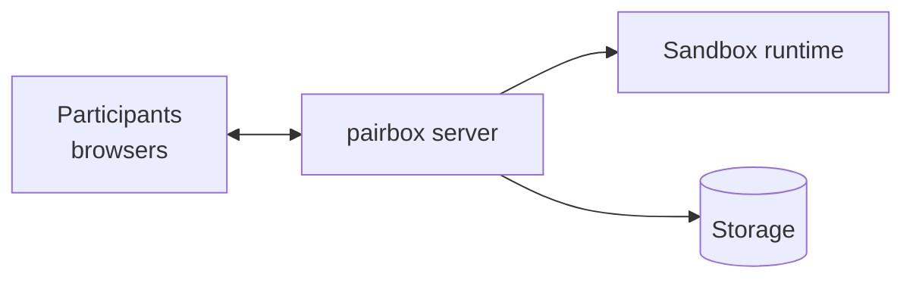
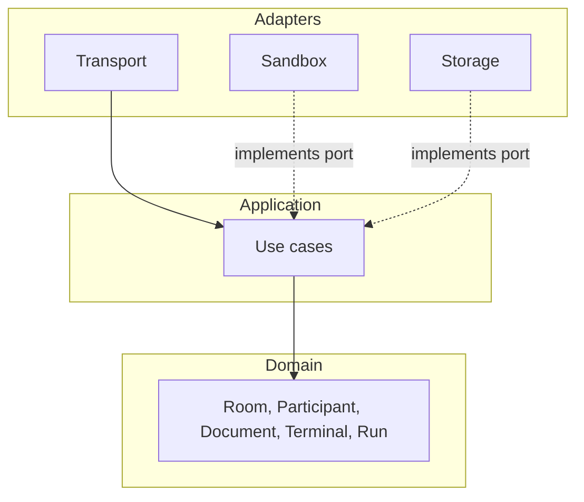
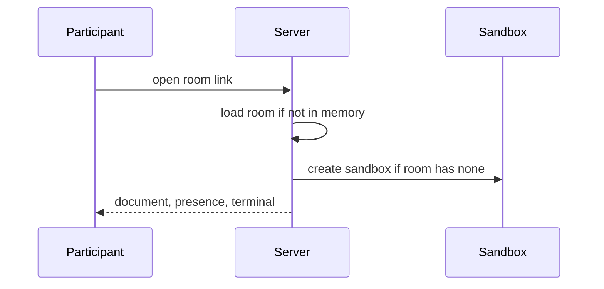
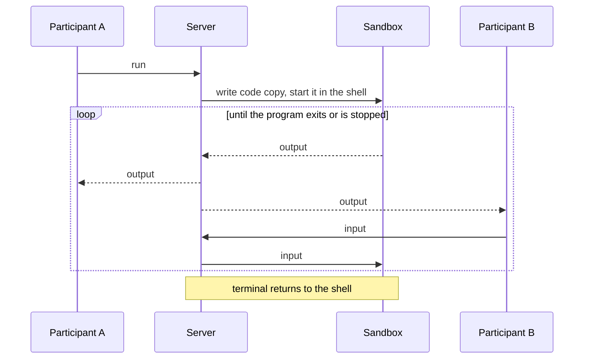

# pairbox — design

pairbox is a self-hosted collaborative coding pad. The host shares a link. Everyone in the room edits the same code in the browser and works in the same terminal, which runs in an isolated sandbox.

## Scope

**In scope**

- Real-time collaborative editing, with nothing for guests to install.
- An editor in the browser good enough that nobody misses their IDE.
- A shared, interactive terminal for each room that everyone can see and type into.
- Self-hosting on one machine with one command.

**Out of scope for now**

- Accounts and multi-tenancy. A single host secret is enough for a self-hosted tool.
- Desktop editor plugins. All effort goes into the browser editor.
- Multi-file projects. One file per room keeps the document model simple.
- Reconnect handling. It can be added once the core works.

## Principles

- **The core is pure.** Domain logic never touches the network, containers or disks, so it can be tested on its own.
- **Infrastructure is replaceable.** The core declares what it needs through ports, and adapters provide it. Changing a technology means writing a new adapter.
- **Dependencies point inward.** Adapters know about the core; the core never knows about adapters.
- **Editing and execution are isolated from each other.** They use separate channels, so heavy terminal output never slows down typing.

## System overview

| Part | Role |
|---|---|
| **Browser** | Editor, presence and terminal. Holds no authority. |
| **Server** | The single source of truth. It holds every active room, relays changes between participants, and controls sandboxes. |
| **Sandbox runtime** | Runs one isolated environment per active room. |
| **Storage** | Keeps room documents so they survive restarts. |

## Domain

| Concept | Meaning | Rules |
|---|---|---|
| **Room** | A shared workspace reached by a link | Has one document, one language and one terminal. Exists until the host deletes it. |
| **Participant** | Someone connected to a room | Anonymous, identified by a display name. Everyone has the same permissions. |
| **Document** | The code being edited | Concurrent edits always merge, with no locking. |
| **Terminal** | A shell inside the room's sandbox | Shared by all participants. Created when a room becomes active, destroyed when it goes idle or is reset. |
| **Run** | One execution of the document in the terminal | One at a time per room. Uses a copy of the code taken when Run is clicked. |

## Layers

| Layer | Contains |
|---|---|
| **Domain** | The concepts and rules above. |
| **Application** | Use cases: create, join and delete a room; edit; run, stop and reset; send terminal input. It defines the ports it depends on: sandbox, storage and notifier. |
| **Adapters** | The browser transport, the sandbox runtime and storage, each implementing a port. |

## Client

| Part | Shared | Purpose |
|---|---|---|
| **Editor** | Yes | Highlighting, autocomplete and remote cursors on the shared document and language |
| **Presence** | Yes | Who is here, and where their cursors are |
| **Terminal** | Yes | A shell between runs, live program I/O during runs, plus Run, Stop and Reset |
| **Preferences** | No | Theme and keymap (vim, emacs), personal to each participant |

## Communication

| Channel | Carries | Why it is separate |
|---|---|---|
| **Collaboration** | Edits, cursors, presence | Merged by a CRDT, so it needs no ordering guarantees from the server |
| **Session** | Terminal input and output, run, stop, reset, language change | Ordered streams that may be heavy and must never delay editing |

## Flows

### Join

### Run

**Stop** interrupts the program. **Reset** replaces the sandbox with a clean one.

## Sandbox

The sandbox is where untrusted code and commands run, so isolation comes before features.

| Constraint | Policy | Reason |
|---|---|---|
| Network | None | No attacks on the host network or the internet |
| Filesystem | Read-only, plus a scratch workspace | Programs can write files without changing the image |
| Privileges | Non-root, no capabilities | Limits the damage if someone breaks out |
| Resources | Capped CPU, memory, disk and processes | One room can't starve the host |
| Output | Rate-limited | A runaway loop can't flood every browser |
| Lifetime | Ends when the room is idle, and after a maximum age | Resources are given back |
| Capacity | Global cap on active sandboxes, extra requests refused | The host stays predictable under load |

The sandbox state is never saved; only the document is. Languages are configured as an environment image plus a run command, so adding one needs no code change.

## Security

- **Creating and deleting rooms** requires the host secret.
- **Joining** requires only the link, so the room ID must be hard to guess.
- **The server controls the sandbox runtime**, so the host machine must trust it. Use stronger isolation (a user-space kernel or microVMs) whenever the host supports it.

## Deployment

The server runs on the host next to a sandbox runtime. Guests reach it through an exposed port or a tunnel. Only active rooms are held in memory; the rest are loaded from storage when someone opens their link.

## Proposed technologies

These are suggestions. Each one sits behind an adapter.

**TypeScript everywhere.** Using one language for the browser and the server keeps the project simple:

- **One CRDT library.** Yjs is native JavaScript, so the browser and server run the same code instead of a port.
- **Shared types.** Domain concepts and session messages are defined once, so the client and server can't drift apart.
- **The hard parts don't depend on the language.** Sandbox isolation and terminal handling come down to Docker settings and terminal plumbing, and Node has mature libraries for both.
- **Performance isn't a constraint.** A self-hosted pad with a few people per room doesn't need a systems language.

| Concern | Proposal | Alternatives |
|---|---|---|
| Language | TypeScript (strict), browser and server | Rust or Go on the server |
| Server runtime | Node.js | Bun, Deno |
| CRDT | Yjs | Automerge, Loro |
| Transport | WebSockets | WebTransport |
| Sandbox | Docker | gVisor, Firecracker, nsjail |
| Storage | SQLite | Postgres, files |
| Editor | CodeMirror 6 | Monaco |
| Terminal | xterm.js | hterm |
| Frontend | Svelte 5 + Vite | SolidJS, plain TypeScript |
| UI components | shadcn-svelte (Bits UI + Tailwind) | Bits UI alone, plain CSS |
| Packaging | Docker Compose | Single executable via Bun |

## Milestones

1. **Shared editor.** Two browsers edit the same document.
2. **Terminal.** A shared shell per room, Run, and all sandbox limits, for one language.
3. **Usable.** Language picker, presence, Stop, Reset, host secret.
4. **Persistent.** Rooms survive restarts and can be deleted.
5. **Later.** Reconnects, read-only links, interviewer and candidate roles, chat, language-server features.
