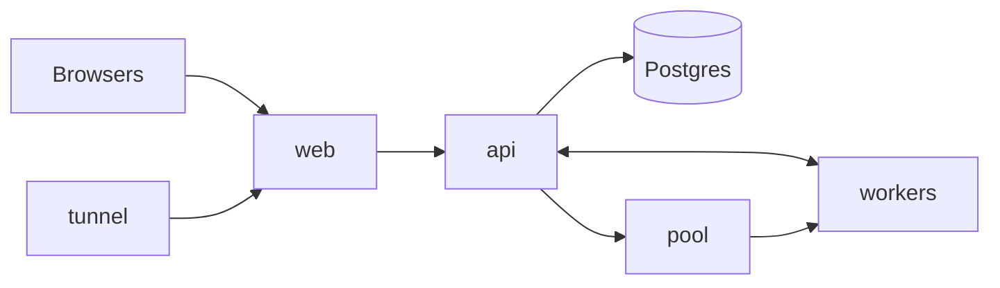

# pairbox

I vibe-coded a CoderPad because I was bored. Share a link, write code together in the browser, and run it in a real, sandboxed shell that everyone in the room sees and types into.

- Live collaborative editor (CodeMirror + Yjs) with cursors and presence
- A shared terminal per room, on a real `bash` in an isolated worker
- Python and TypeScript, a waiting line when all workers are busy
- Accounts (email and password) for hosts; guests join by link, no account
- Invite links that work from any network, through a Cloudflare tunnel

## Architecture



| Service | Does |
|---|---|
| **web** | nginx serving the Svelte app, forwarding `/api` and `/ws` to the api |
| **api** | Accounts, rooms, the shared documents, and relaying each room's terminal to its worker |
| **pool** | Knows every worker (free, reserved, cleaning) and hands them to rooms, with a queue per runtime |
| **worker** | One room at a time: a real shell as an unprivileged user, cleaned between rooms. A container here; could be a VM |
| **db** | Postgres: users, sessions, rooms, documents |
| **tunnel** | Optional Cloudflare quick tunnel, so invite links work from anywhere |

No service talks to Docker: Docker only stands in for the machines. Workers sit on a private network with no internet access.

## How they talk

| From → to | How | What |
|---|---|---|
| browser → api | HTTP | Sign in, create and list rooms (session cookie) |
| browser ↔ api | WebSocket `/ws/rooms/:id/sync` | Edits, cursors, presence (Yjs protocol) |
| browser ↔ api | WebSocket `/ws/rooms/:id/session` | Terminal input/output, Run, Stop, Reset, runtime |
| api → pool | HTTP | Reserve a worker for a room, or wait in line; release it |
| worker → pool | HTTP | Register and heartbeat |
| api ↔ worker | WebSocket `/terminal` | Write the code, shell I/O, run, exit codes |

Opening a room: the api loads it, asks the pool for a worker of its runtime, then connects the room's terminal to it. Editing works right away; the terminal attaches as soon as a worker is free. The worker goes back to the pool (and is wiped) when the room is idle.

Request and message shapes live once, as Zod schemas, in `packages/shared`.

## Run it

Needs Docker.

```sh
cp .env.example .env
docker compose up --build -d
docker compose logs tunnel   # the public https://….trycloudflare.com address
```

Open http://localhost:8080, create an account, create a room. API docs: http://localhost:8742/docs.

| | |
|---|---|
| Frontend with hot reload | `pnpm install && pnpm dev` → http://localhost:5173 |
| Tests (needs `docker compose up -d db`) | `pnpm test` |
| Checks | `pnpm typecheck && pnpm lint` |
| No tunnel | remove `tunnel` from `COMPOSE_PROFILES` in `.env` |
| More workers | change `replicas` in `compose.yaml` |

## Making it a real product

- **Interviews:** interviewer and candidate roles, private notes, a timer, playback of the whole session.
- **Projects:** a file tree instead of one file, templates, importing a Git repo.
- **Better isolation:** real VMs or Firecracker microVMs for workers, and workers that start on demand instead of a fixed set.
- **Scale:** run workers on other machines (they already register themselves), autoscaling, quotas per user.
- **Editor:** language servers for autocomplete and errors, more runtimes, debugging.
- **Reliability:** reconnecting after network drops, saving terminal history.
- **Teams:** shared rooms and roles, single sign-on, usage-based billing.

## Stack

TypeScript everywhere: Svelte 5, Vite, Tailwind, shadcn-svelte, CodeMirror, xterm.js, Yjs, Fastify, Drizzle, Postgres, node-pty, Docker Compose.
