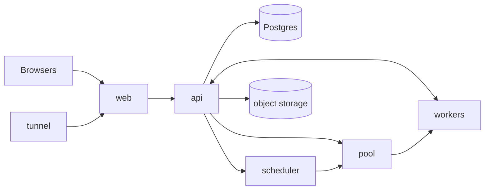

# pairbox

I vibe-coded a CoderPad because I was bored. Share a link, write code together in the browser, and run it in a real, sandboxed shell that everyone in the room sees and types into.

- Schedule sessions (30 min to 3 h); a sandbox is guaranteed for the whole slot
- Guests join by link and wait in a lobby until the host lets them in
- Live collaborative editor (CodeMirror + Yjs) with cursors and presence
- A shared terminal per room, on a real `bash` in an isolated worker (Python or TypeScript)
- Every session is recorded and can be replayed: code, cursors, terminal, who did what
- Accounts (email and password) for hosts; invite links that work from any network

## Architecture



| Service | Does |
|---|---|
| **web** | nginx serving the Svelte app, forwarding `/api` and `/ws` to the api |
| **api** | Accounts, sessions, the lobby, the shared documents, recordings, and relaying each room's terminal to its worker |
| **scheduler** | The calendar: books sessions without ever booking more at once than there are workers |
| **pool** | Knows every worker (free, reserved, cleaning) and hands them to rooms, with a queue per runtime |
| **worker** | One room at a time: a real shell as an unprivileged user, cleaned between rooms. A container here; could be a VM |
| **db** | Postgres: users, rooms, documents, bookings, the recordings index |
| **storage** | S3-compatible object storage (SeaweedFS) for recordings |
| **tunnel** | Optional Cloudflare quick tunnel, so invite links work from anywhere |

No service talks to Docker: Docker only stands in for the machines. Workers sit on a private network with no internet access.

## How they talk

| From → to | How | What |
|---|---|---|
| browser → api | HTTP | Sign in, book sessions, ask to join and let guests in (session cookie) |
| browser ↔ api | WebSocket `/ws/rooms/:id/sync` | Edits, cursors, presence (Yjs protocol) |
| browser ↔ api | WebSocket `/ws/rooms/:id/session` | Terminal input/output, Run, Stop, Reset, join requests |
| api → scheduler | HTTP | Book or cancel a slot, list free times |
| api → pool | HTTP | Reserve a worker for a room, or wait in line; release it |
| api → storage | S3 API | Write and read recordings |
| worker → pool | HTTP | Register and heartbeat |
| api ↔ worker | WebSocket `/terminal` | Write the code, shell I/O, run, exit codes |

A session's life: the host books a slot and the scheduler guarantees a worker for it. Before it starts, the link shows a countdown (the host can open it 10 minutes early). Guests ask to join and the host lets them in; only the host and admitted guests can open the room's channels. At the end of the slot everyone is disconnected, the worker is wiped and returned to the pool, and the session is available to replay.

Request and message shapes live once, as Zod schemas, in `packages/shared`.

## Run it

Needs Docker.

```sh
cp .env.example .env
docker compose up --build -d
docker compose logs tunnel   # the public https://….trycloudflare.com address
```

Open http://localhost:8080, create an account, create a room. API docs: http://localhost:8742/docs.

| | |
|---|---|
| Frontend with hot reload | `pnpm install && pnpm dev` → http://localhost:5173 |
| Tests (needs `docker compose up -d db`) | `pnpm test` |
| Checks | `pnpm typecheck && pnpm lint` |
| No tunnel | remove `tunnel` from `COMPOSE_PROFILES` in `.env` |
| More workers | change `replicas` in `compose.yaml` (more sessions can then be booked at once) |

## Making it a real product

- **Interviews:** private interviewer notes, scorecards, question banks, calendar invites.
- **Projects:** a file tree instead of one file, templates, importing a Git repo.
- **Better isolation:** real VMs or Firecracker microVMs for workers, and workers that start on demand instead of a fixed set.
- **Scale:** run workers on other machines (they already register themselves), autoscaling, quotas per user.
- **Editor:** language servers for autocomplete and errors, more runtimes, debugging.
- **Reliability:** reconnecting after network drops, saving terminal history.
- **Teams:** shared rooms and roles, single sign-on, usage-based billing.

## Stack

TypeScript everywhere: Svelte 5, Vite, Tailwind, shadcn-svelte, CodeMirror, xterm.js, Yjs, Fastify, Drizzle, Postgres, node-pty, Docker Compose.
